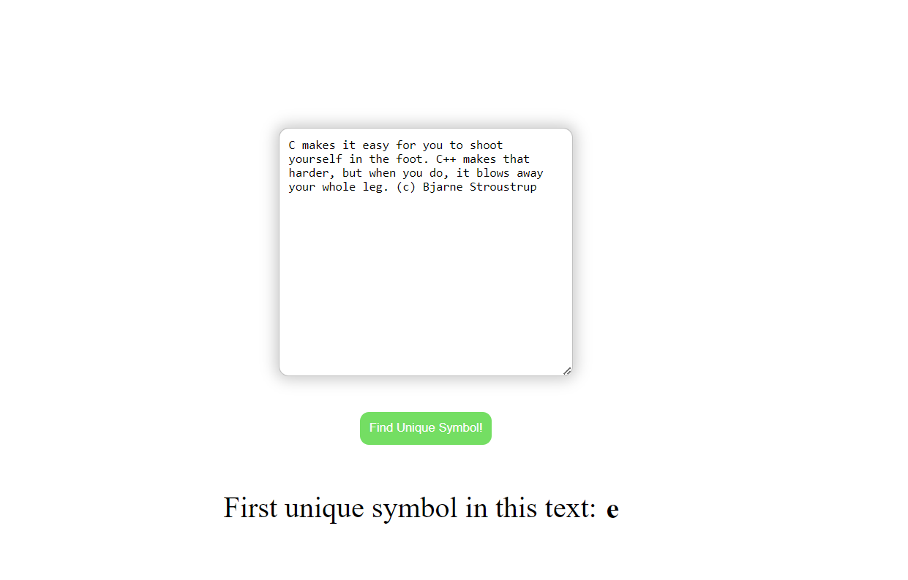

# BAD-Test
## Run code
You can test the work of this code by clicking on the [link](https://asya982.github.io/BAD-Test/)

## Explanation
`scripts` - this folder contain JS functions:

- `algorithm.js` - contains my realisation of this task
- `index.js` - is file which is controll user interaction with page

`index.html` - basic HTML for easy and pleasant testing my code

`statis` - this folder contains CSS file for stylying page and demo-photo of my results

### Main idea
At first I divide full text into array of words and for every word find first unique symbol and add it to array of general unique symbols

Then find first unique symbol in collection of general unique symbols

I created general function which finds first unique symbol of array with following methods of array in JS - `filter`, `indexOf`, `lastIndexOf`

## Results
