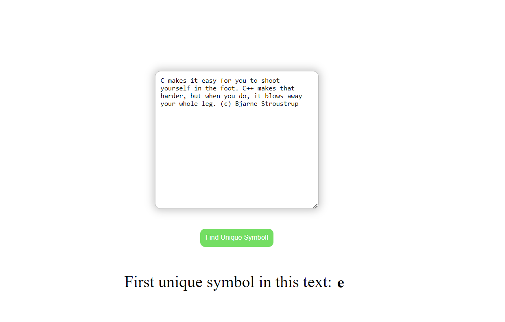

# BAD-Test
## Run code
You can test the work of this code by clicking on the [link]()

## Explanation
`algorithm.js` - this file contain main function with my realisation of task 

`statis` - this folder contains HTML, CSS and JS which a I made only for creating pleasant page to test my code
### Main idea
At first I divide full text into array of words and for every word find first unique symbol and add it to array of general unique symbols

Then find first unique symbol in collection of general unique symbols

I created general function which finds first unique symbol of array with following methods of array in JS - `filter`, `indexOf`, `lastIndexOf`

## Results
